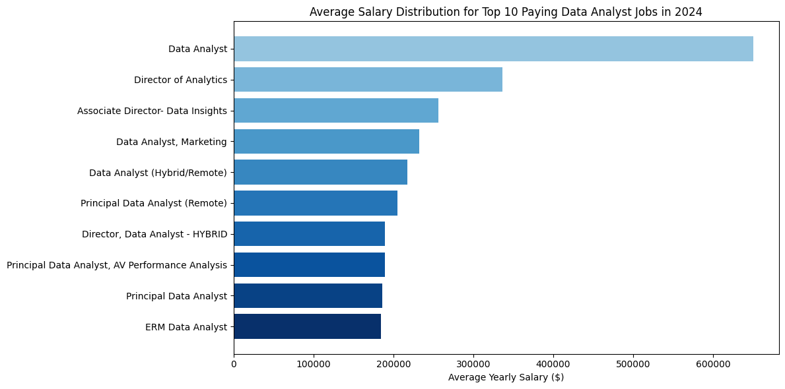
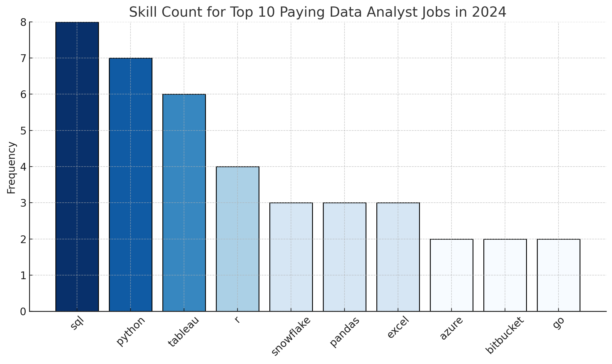

# Introduction
📊 Dive into the data job market! Focusing on data analyst roles, this project explores 💰 top-paying jobs, 🔥 in-demand skills, and ✅ where high demand meets high salary in data analytics.

🔎 SQL queries? Check them out here: [project_sql_queries folder](/project_sql_queries/)

# Background
Driven by a quest to navigate the data analyst job market more effectively.

### The questions I wanted to answer through my SQL queries were:

1. What are the top-paying data analyst jobs?
2. What skills are required for these top-paying jobs?
3. What skills are most in demand for data analysts?
4. Which skills are associated with higher salaries?
5. What are the most optimal skills to learn?

# Tools I Used
For my deep dive into the data analyst job market, I harnessed the power of several key tools:

- **SQL:** The backbone of my analysis, allowing me to query the database and unearth critical insights.
- **PostgreSQL:** The chosen database management system, ideal for handling the job posting data.
- **Cursor:** My go-to for database management and executing SQL queries.
- **Git & GitHub:** Essential for version control and sharing my SQL scripts and analysis, ensuring collaboration and project tracking.

# The Analysis
Each query for this project aimed at investigating specific aspects of the data analyst job market. Here’s how I approached each question:

### 1. Top Paying Data Analyst Jobs
To identify the highest-paying roles, I filtered data analyst positions by average yearly salary and location, focusing on remote jobs. This query highlights the high paying opportunities in the field.

***Here’s the breakdown of the top data analyst jobs in 2024:***

- **Wide Salary Range:** Top 10 paying data analyst roles span from $184,000 to $650,000, indicating significant salary potential in the field.

- **Diverse Employers:** Companies like SmartAsset, Meta, and AT&T are among those offering high salaries, showing a broad interest across different industries.

- **Job Title Variety:** There’s a high diversity in job titles, from Data Analyst to Director of Analytics, reflecting varied roles and specializations within data analytics.

### 2. Skills Required for Top Paying Jobs
This query reveals the skills required for the top 10 highest-paying data analyst positions, offering insight into what tools and technologies are associated with the best salaries.

- **SQL and Python frequently appear** among the top-paying roles, confirming their value in high-compensation jobs.

- **Cloud and big data tools** such as Azure and Databricks show up often, indicating a demand for infrastructure-related skills.

- **Multiple roles share overlapping skill sets,** suggesting these technologies are foundational for top-tier analyst jobs.

### 3. Most In-Demand Skills
This query surfaces the top 5 skills most frequently required in data analyst job postings—critical knowledge for entering the job market.

### 4. Top Paying Skills for Data Analysts
This query ranks skills by the average salary of jobs requiring them, helping identify which technologies lead to higher compensation.

### 5. Most Optimal Skills to Learn
Combining demand and salary, this query identifies the most strategic skills for data analysts to pursue for job security and high pay.

# What I Learned

Throughout this adventure, I’ve turbocharged my SQL toolkit with some serious firepower:

- **🧩 Complex Query Crafting:** Mastered the art of advanced SQL, merging tables like a pro and wielding WITH clauses for ninja-level temp table maneuvers.

- **📊 Data Aggregation:** Got cozy with GROUP BY and turned aggregate functions like COUNT() and AVG() into my data-summarizing sidekicks.

- **🧠 Analytical Wizardry:** Leveled up my real-world puzzle-solving skills, turning questions into actionable, insightful SQL queries.

# Conclusions

### Insights
From the analysis, several general insights emerged:

1. **Top-Paying Data Analyst Jobs**: The highest-paying jobs for data analysts that allow remote work offer a wide range of salaries, the highest at $650,000!

2. **Skills for Top-Paying Jobs**: High-paying data analyst jobs require advanced proficiency in SQL, suggesting it’s a critical skill for earning a top salary.

3. **Most In-Demand Skills**: SQL is also the most demanded skill in the data analyst job market, thus making it essential for job seekers.

4. **Skills with Higher Salaries**: Specialized skills, such as SVN and Solidity, are associated with the highest average salaries, indicating a premium on niche expertise.

5. **Optimal Skills for Job Market Value**: SQL leads in demand and offers for a high average salary, positioning it as one of the most optimal skills for data analysts to learn to maximize their market value.
